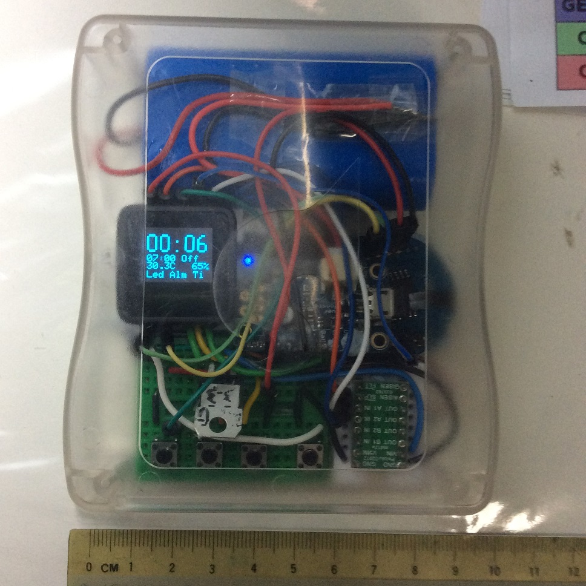

vibrate_alarm_clock_2
===================

An alarm clock with vibration, battery monitoring and wireless (induction) charging capabilities.  Buttons available to set the time/alarm, turn off OLED and reset. This device is meant for my friend's birthday gift. 

As you can tell from the name, this is the second version. It has been slightly streamlined compared to the [first](https://github.com/yeokm1/vibrate_alarm_clock).

Front, fully assembled.

Side view with top open. A Qi wireless charger in the background. Not so messy this time.

More pictures during the assembly/testing phase at the end.

##Parts used
1. [Microview](https://www.sparkfun.com/products/12923) with 64x48 OLED screen (based on ATmega328P chip)  
2. [Chronodot](http://docs.macetech.com/doku.php/chronodot_v2.0) v2.1 Real Time Clock (based on DS3231 temperature compensated RTC crystal)
3. [Adafruit PowerBoost 500 Charger](https://learn.adafruit.com/adafruit-powerboost-500-plus-charger/overview)
4. 3.3V voltage regulator (LD1117V33)
5. 4x button switches (1 switch as reset button)  
6. [Pololu DRV8833](http://www.pololu.com/product/2130) dual motor driver  
7. 500mA Qi wireless receiver module
8. 10mm vibration motor
9. 4400mAh Lithium battery

Others:  

1. 1x half-breadboard 
2. 4x mini-breadboard (2x8 points)
3. Translucent case  

This schematic only represents the logical connections I made. The physical connections differs due to space issues.
Closest components used as Fritzing does not have them.

1. MD030A as DRV8833 motor driver. (Pin 6 on the Microview is connected to the sleep pin on the DRV8833.)
2. RTC module as Chronodot
3. The battery is a cylindrical style 4400mAh one.

##Differences with [version 1 (V1)](https://github.com/yeokm1/vibrate_alarm_clock)
1. No more pull-down resistors for the switches. I use the internal pull-up resistors of the Arduino by setting pinmode to INPUT_PULLUP.
2. Battery capacity: The battery size was an afterthought in V1. The battery size is now more than 4x larger.
3. Power consumption: Reduced by putting the Arduino to sleep and only waking via alarm interrupts from the Chronodot or button press. Even if alarm is enabled, current use is 34mA with display on and 16mA when in sleep giving battery life at approximately 5 and 11 days respectively. (See pictures below)
4. The Pololu DRV8833 motor driver is powered behind a 3.3V regulator as 5V is too high for the 10mm vibration motor.
5. Display the temperature of the Chronodot.
6. Qi wireless charging. Frequent plugging in and out of the micro-USB cable may wear-out/damage the connector. Wireless charging is convenient too!
7. Removed speaker as it is rather soft. Even the vibration motor is louder than the speaker!

##Notes
1. The Analog to Digital Converter (ADC) of the Microview is rather unstable. As the battery voltage is retrieved via the ADC, I had to do a running average to get a stable value to display.

##Pictures during assembly/testing

Current while in sleep mode. Hardware folks may say I can do better but I don't really have time to optimise so much.

Current with screen on and no sleep. Current usage more than doubles.

Side profile.

On my Qi wireless charge pad. Notice the orange charge light on the Adafruit PowerBoost charger.

Under the motor driver is where I "hide" the vibrator to prevent it from jumping out of place as experienced in V1.

I use the very nifty [adjustable voltage generator](https://learn.adafruit.com/adjustable-breadboard-power-supply-kit) to simulate a battery at different voltage levels to verify the battery percent readings.

##References and libraries
1. [Creating fonts for Microview](http://learn.microview.io/font/creating-fonts-for-microview.html)
2. [DS3232 RTC library](https://github.com/JChristensen/DS3232RTC)
3. [Rocketscream Low Power library](http://www.rocketscream.com/blog/2011/07/04/lightweight-low-power-arduino-library/)
